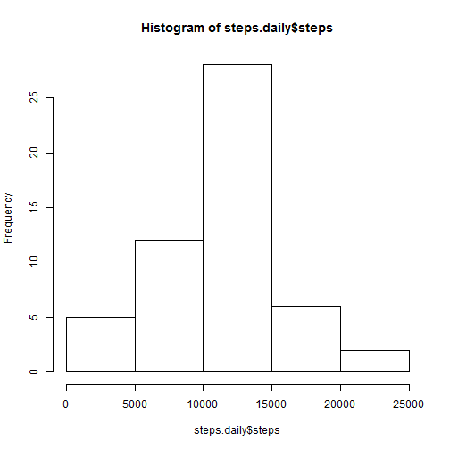
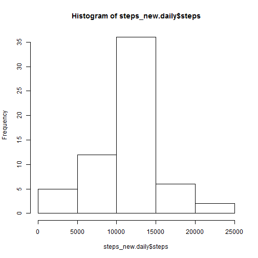
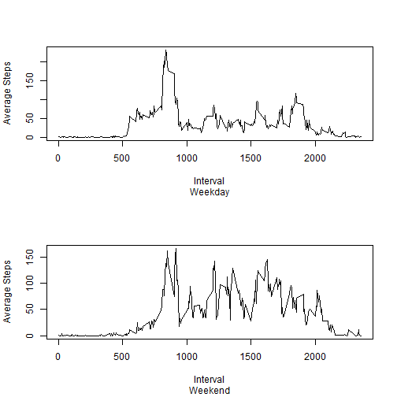

## Loading and preprocessing the data

First load the data


```r
df_data <- read.csv("C:\\Users\\aozbay\\Desktop\\Reproducible Research\\activity.csv")
head(df_data)
```

```
##   steps       date interval
## 1    NA 2012-10-01        0
## 2    NA 2012-10-01        5
## 3    NA 2012-10-01       10
## 4    NA 2012-10-01       15
## 5    NA 2012-10-01       20
## 6    NA 2012-10-01       25
```

Looks like there are NAs in the steps column. Remove the records with NAs for the time being. We will do a better job of imputing later.


```r
df_data <- df_data[complete.cases(df_data),]
head(df_data)
```

```
##     steps       date interval
## 289     0 2012-10-02        0
## 290     0 2012-10-02        5
## 291     0 2012-10-02       10
## 292     0 2012-10-02       15
## 293     0 2012-10-02       20
## 294     0 2012-10-02       25
```


## What is mean total number of steps taken per day?

Let's first calculate the stepstaken each day


```r
steps.daily <- aggregate(df_data$steps, by=list(df_data$date), FUN=sum)
colnames(steps.daily) <- c("date","steps")
head(steps.daily)
```

```
##         date steps
## 1 2012-10-02   126
## 2 2012-10-03 11352
## 3 2012-10-04 12116
## 4 2012-10-05 13294
## 5 2012-10-06 15420
## 6 2012-10-07 11015
```

Let's take a look at the historgram


```r
hist(steps.daily$steps)
```

 

What are the mean and median of steps?


```r
steps.summary <- summary(steps.daily$steps)
steps.median <- steps.summary[3]
steps.mean <- steps.summary[4]
print(steps.summary)
```

```
##    Min. 1st Qu.  Median    Mean 3rd Qu.    Max. 
##      41    8840   10800   10800   13300   21200
```

The median is 1.08 &times; 10<sup>4</sup> and the mean is 1.08 &times; 10<sup>4</sup>.

## What is the average daily activity pattern?

First let's find the average number of steps taken each 5 minute period


```r
steps.five_minperiod <- aggregate(df_data$steps, list(df_data$interval), mean)
colnames(steps.five_minperiod ) <- c("interval", "avg.steps")
head(steps.five_minperiod)
```

```
##   interval avg.steps
## 1        0   1.71698
## 2        5   0.33962
## 3       10   0.13208
## 4       15   0.15094
## 5       20   0.07547
## 6       25   2.09434
```

Then let's plot it to see if there is a pattern


```r
plot(y=steps.five_minperiod$avg.steps, x=steps.five_minperiod$interval, type="l"
    ,xlab="Interval"
    ,ylab="Average Steps")
```

 


The 5-minute interval, on average across all the days, that contains the maximum number of steps is 835 with 206.1698 average steps.

## Imputing missing values

We originally removed records with NAs. Let's do a better job by imputing them. First load the data again.


```r
df_data_new <- read.csv("C:\\Users\\aozbay\\Desktop\\Reproducible Research\\activity.csv")
head(df_data_new)
```

```
##   steps       date interval
## 1    NA 2012-10-01        0
## 2    NA 2012-10-01        5
## 3    NA 2012-10-01       10
## 4    NA 2012-10-01       15
## 5    NA 2012-10-01       20
## 6    NA 2012-10-01       25
```

```r
steps_new.num_missing_vals <- sum(is.na(df_data_new$steps))
```

There are 2304 missing values. We already have the mean values for each interval. Let's substitute these means for the missing values.


```r
df_data_temp <- df_data_new[is.na(df_data_new$steps),]
df_data_temp <- merge(df_data_temp, steps.five_minperiod, by="interval")
df_data_temp$steps <- df_data_temp$avg.steps
df_data_temp$avg.steps <- NULL
df_data_new <- rbind(df_data_new[!is.na(df_data_new$steps),], df_data_temp)
df_data_new <- df_data_new[order(df_data_new$date, df_data_new$interval),]
rownames(df_data_new) <- 1:nrow(df_data_new)
head(df_data_new)
```

```
##     steps       date interval
## 1 1.71698 2012-10-01        0
## 2 0.33962 2012-10-01        5
## 3 0.13208 2012-10-01       10
## 4 0.15094 2012-10-01       15
## 5 0.07547 2012-10-01       20
## 6 2.09434 2012-10-01       25
```

Now let's recalculate the stepstaken each day


```r
steps_new.daily <- aggregate(df_data_new$steps, by=list(df_data_new$date), FUN=sum)
colnames(steps_new.daily) <- c("date","steps")
head(steps_new.daily)
```

```
##         date steps
## 1 2012-10-01 10766
## 2 2012-10-02   126
## 3 2012-10-03 11352
## 4 2012-10-04 12116
## 5 2012-10-05 13294
## 6 2012-10-06 15420
```

Let's take a look at the historgram


```r
hist(steps_new.daily$steps)
```

 

What are the mean and median of steps?


```r
steps_new.summary <- summary(steps_new.daily$steps)
steps_new.median <- steps_new.summary[3]
steps_new.mean <- steps_new.summary[4]
print(steps_new.summary)
```

```
##    Min. 1st Qu.  Median    Mean 3rd Qu.    Max. 
##      41    9820   10800   10800   12800   21200
```

The new median is 1.08 &times; 10<sup>4</sup> and the new mean is 1.08 &times; 10<sup>4</sup>.
Previously the median was 1.08 &times; 10<sup>4</sup> and the mean was 1.08 &times; 10<sup>4</sup>.

Only the median value changed after the imputation, as expected.


## Are there differences in activity patterns between weekdays and weekends?

In order to find any patterns between weekdays and weekends, let's modify our data frame a little.


```r
df_data_new$day_of_week <- weekdays(as.Date(df_data_new$date))
df_data_new$day_label <- "weekday"
df_data_new[(df_data_new$day_of_week == "Saturday" | df_data_new$day_of_week == "Sunday"),"day_label"] <- "weekend"
df_data_new$day_of_week <- NULL
head(df_data_new)
```

```
##     steps       date interval day_label
## 1 1.71698 2012-10-01        0   weekday
## 2 0.33962 2012-10-01        5   weekday
## 3 0.13208 2012-10-01       10   weekday
## 4 0.15094 2012-10-01       15   weekday
## 5 0.07547 2012-10-01       20   weekday
## 6 2.09434 2012-10-01       25   weekday
```

Let's calculate the average steps by interval by day_label


```r
avg_steps <- aggregate(df_data_new$steps, list(df_data_new$interval, df_data_new$day_label), FUN=mean)
colnames(avg_steps) <- c("interval", "day_label", "avg_steps")
par(mfcol=c(2,1))
plot(y=avg_steps[avg_steps$day_label=="weekday","avg_steps"],
     x=avg_steps[avg_steps$day_label=="weekday","interval"],
     type="l",
     xlab="Interval",
     ylab="Average Steps",
     sub="Weekday")
plot(y=avg_steps[avg_steps$day_label=="weekend","avg_steps"],
     x=avg_steps[avg_steps$day_label=="weekend","interval"],
     type="l",
     xlab="Interval",
     ylab="Average Steps",
     sub="Weekend")
```

 


